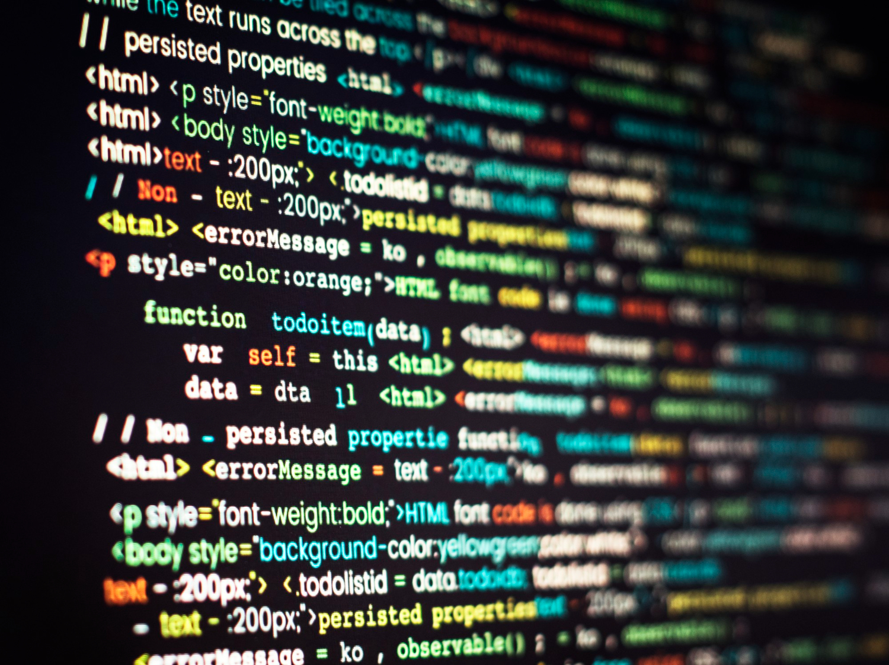

console.log('Hello world);

Witam wszystkich na tym pamiętniko/blogu, bo chyba taka nazwa będzie najwłasciwsza.

Na początku parę informacji from me to You Moj Drogi czytelniku.

Mam na imię Rafał, jestem szczęśliwym studentem przecuuuuudownej polskiej politechniki a także korepetytorem matematyki dla mniejszych i tych trochę większych 

Doświadczenie zdobyte podczas walki z przeróżnymi dziwnymi przedmiotami na studiach pomogły mi podjąć pewną istotną decyzję ...

Web Dev albo śmierć...   (tu oklaski dla wskaźników oraz assemblera 👏)

Stąd jestem teraz tu gdzie jestem(tak aktualnie to w Macu sącząc pyszną kawunie... pamietajcie zimna najlepsza ☕️).

Na tym blogu będę chiał pokazywać wszystko to czego się nauczyłem, nad czym pracuje, wszystkie blaski i cienie w drodze do bycia devem.

Zatem Wam i sobie życzę świetnej zabawy.

Do zobaczenia jutro 

eR

 <a href="https://www.freepik.com/free-photo/computer-program-coding-screen_18415585.htm#page=5&query=learn%20programming&position=9&from_view=keyword&track=ais"> Image by rawpixel.com</a> on Freepik
